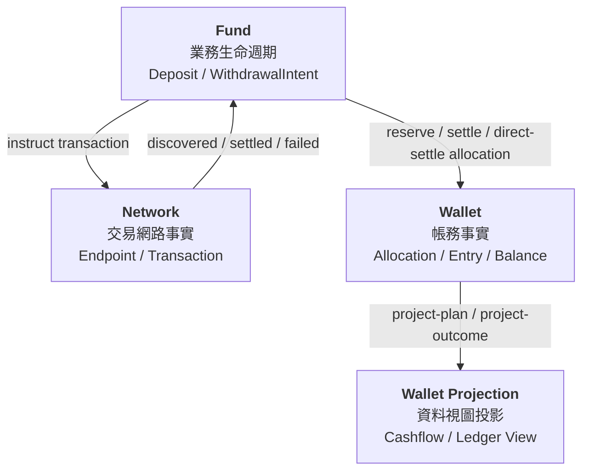
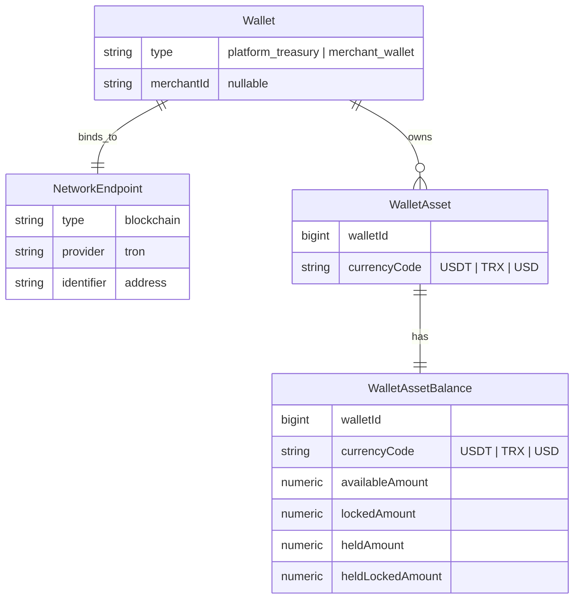
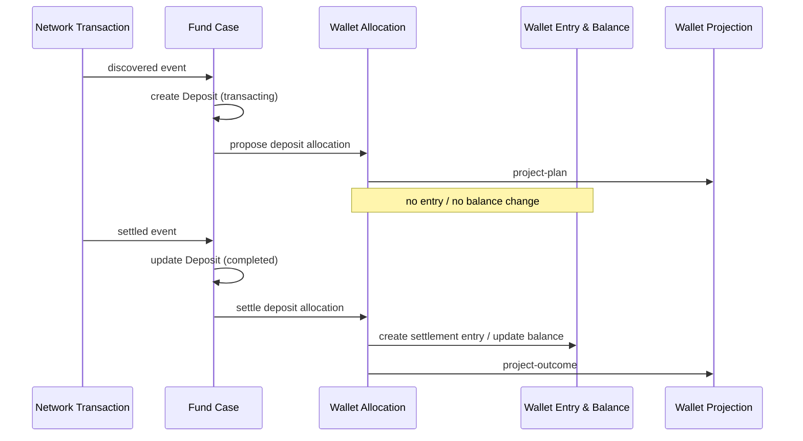
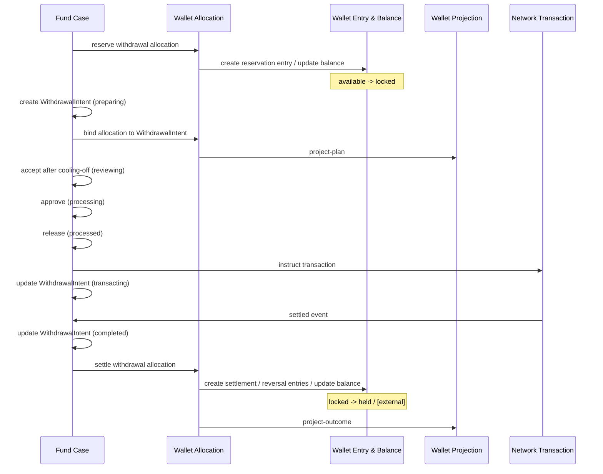
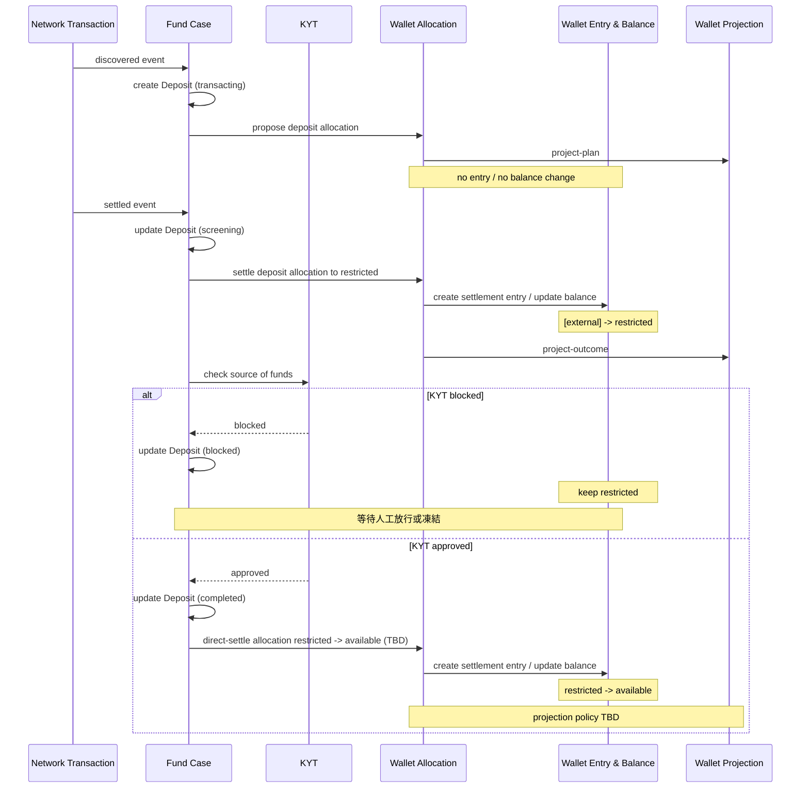
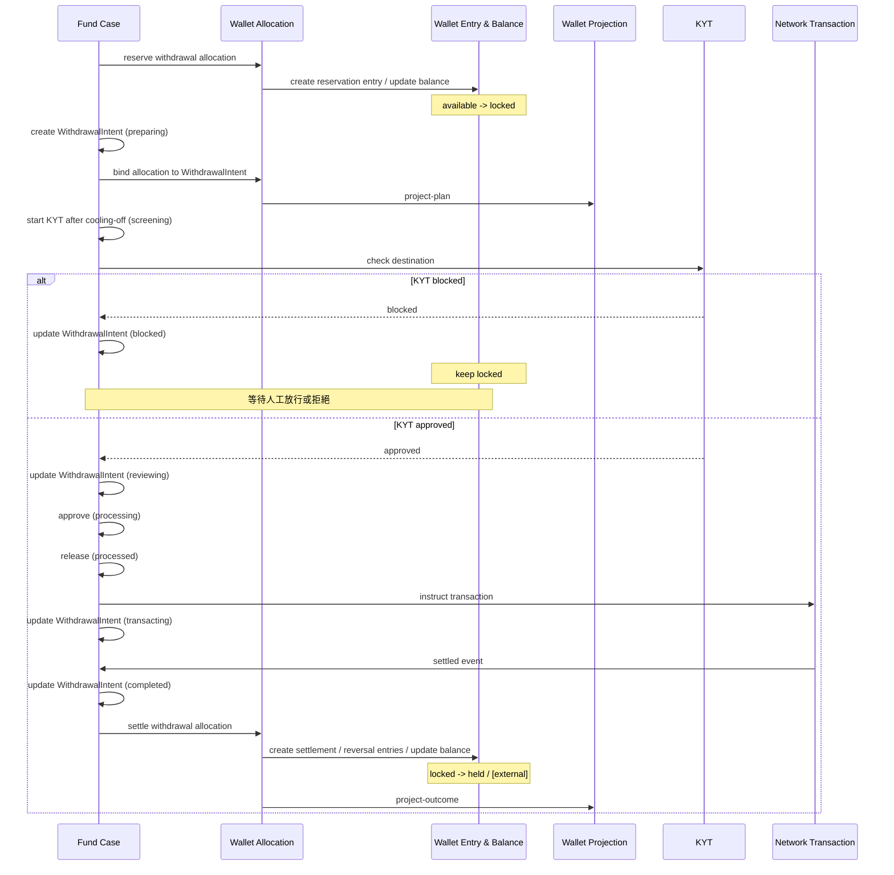

# Fund Case Wallet Allocation and KYT Discussion

> 會議目的：先對齊現行 Fund Case → Wallet Allocation → Entry / Balance → Ledger Projection 模型，再討論 KYT 對 Deposit / Withdrawal Intent 的擴展點。

---

## 0. Discussion Goal

- 說明現行 deposit / withdrawal intent 如何驅動 wallet accounting
- 對齊 Wallet 4 buckets 與 allocation / entry / ledger projection 的責任分層
- 提案 KYT gate 導入後，bucket 與 fund case status 需要如何調整
- 收斂後續設計決策與 implementation planning input

---

## 1. Fund Case Wallet Allocation 概念

### 1.1 三領域責任邊界



- Fund：管理業務生命週期與流程推進
- Network：記錄交易網路事實，處理外部交易狀態
- Wallet：執行資金配置、帳務事實與餘額變動
- Wallet Projection：投影 Cashflow / Ledger 等使用者與營運視圖

---

### 1.2 Wallet 基本實體與 Bucket Balance 模型



- Wallet：平台或商戶持有的錢包，綁定交易網路端點
- WalletAsset：特定 Wallet 下的特定幣別資產
- WalletAssetBalance：以 bucket 維度記錄該資產餘額
- WalletBucket：現行 4 buckets

| Bucket      | 語意                        |
| ----------- | --------------------------- |
| available   | 可用餘額                    |
| locked      | 出金 reservation / 暫時圈存 |
| held        | 平台持有 / 費用歸屬         |
| held_locked | 平台持有資金的暫時圈存      |

---

### 1.3 Wallet Entry 與 Balance

- `WalletEntry` / `WalletEntryLine` 是資金唯一事實基礎：只可登簿，不可刪改
- `WalletAssetBalance` 完全由 `WalletEntry` / `WalletEntryLine` 驅動變動

#### 範例 1: Withdrawal Intent Reservation

情境：提領 1000 USDT，service fee 2%

| Wallet          | Currency | Bucket    | Amount Delta |
| --------------- | -------- | --------- | -----------: |
| Shop One Wallet | USDT     | available |        -1000 |
| Shop One Wallet | USDT     | locked    |        +1000 |

#### 範例 2: Withdrawal Intent Settlement

情境：提領 1000 USDT，service fee 2%

| Wallet          | Currency | Bucket | Amount Delta |
| --------------- | -------- | ------ | -----------: |
| Shop One Wallet | USDT     | locked |        -1000 |
| Shop One Wallet | USDT     | held   |          +20 |

---

### 1.4 Wallet Allocation 為業務活動驅動帳務

- `WalletAllocation` 是業務活動需要動用資金時，交給 Wallet 執行資金配置的基本操作
- Allocation 先記錄 plan，再於終態記錄 outcome
- 支援三種執行模式：
  - 1 phase：direct-settle，一次記錄 plan / outcome 並立即落帳
  - 2 phase projection-first：propose -> settle，先建立處理中視圖，終態才落帳
  - 2 phase with reservation：reserve -> settle / release，先圈存資金，終態再結算或釋放

- AllocationLine 集合描述具體資金動向，Wallet 再依結果展開 Entry / Balance

#### 範例 1: Withdrawal Intent Reservation

情境：提領 1000 USDT，service fee 2%，平台代付 network fee plan 30 TRX

| Role | Side        | Space    | Wallet            | Currency | Bucket    | Kind        | Amount |
| ---- | ----------- | -------- | ----------------- | -------- | --------- | ----------- | -----: |
| plan | source      | internal | Shop One Wallet   | USDT     | available | principal   |    980 |
| plan | source      | internal | Shop One Wallet   | USDT     | available | service_fee |     20 |
| plan | source      | internal | Platform Treasury | TRX      | available | network_fee |     30 |
| plan | destination | external | -                 | USDT     | -         | principal   |    980 |
| plan | destination | internal | Shop One Wallet   | USDT     | held      | service_fee |     20 |
| plan | destination | external | -                 | TRX      | -         | network_fee |     30 |

#### 範例 2: Withdrawal Intent Settlement

情境：提領 1000 USDT，service fee 2%，平台代付 network fee outcome 12.5 TRX

| Role    | Side        | Space    | Wallet            | Currency | Bucket    | Kind        | Amount |
| ------- | ----------- | -------- | ----------------- | -------- | --------- | ----------- | -----: |
| outcome | source      | internal | Shop One Wallet   | USDT     | available | principal   |    980 |
| outcome | source      | internal | Shop One Wallet   | USDT     | available | service_fee |     20 |
| outcome | source      | internal | Platform Treasury | TRX      | available | network_fee |   12.5 |
| outcome | destination | external | -                 | USDT     | -         | principal   |    980 |
| outcome | destination | internal | Shop One Wallet   | USDT     | held      | service_fee |     20 |
| outcome | destination | external | -                 | TRX      | -         | network_fee |   12.5 |

---

### 1.5 Wallet Projection

- Wallet Projection 是針對產品需求定義的資料視圖
- Projection 以 Wallet Allocation 為來源，並隨 2 phase lifecycle 連動更新
- 主要視圖：
  - Cashflow：類似存摺明細
  - Ledger：帳務解釋明細表

#### Cashflow View

- 關注：某個 Wallet 的 available 資產，因業務活動產生 deposit / withdrawal
- 粒度：一個 Wallet × 一個 Currency × 一個 Direction
- 同一幣別的 principal / service fee 可彙總在同一 item

##### 範例: Withdrawal Intent Settlement

情境：提領 1000 USDT，service fee 2%，自付 network fee outcome 12.5 TRX

| Wallet          | Currency | Direction  | Kind                       | Gross Amount | Net Amount | Fee Amount |
| --------------- | -------- | ---------- | -------------------------- | -----------: | ---------: | ---------: |
| Shop One Wallet | USDT     | withdrawal | principal_with_service_fee |         1000 |        980 |         20 |
| Shop One Wallet | TRX      | withdrawal | network_fee                |         12.5 |          0 |       12.5 |

#### Ledger View

- 關注：某個 Wallet 的某項資產，在某個 bucket，因某種 kind 發生異動
- 粒度：一個 Wallet × Currency × Bucket × Kind
- principal / service fee / network fee 需分開列舉
- realization：pending 尚未實現 / partial 部分實現 / realized 完全實現

##### 範例 1: Withdrawal Intent Reservation

情境：提領 1000 USDT，service fee 2%，平台代付 network fee plan 30 TRX

| Wallet            | Currency | Bucket    | Kind        | Plan Amount Delta | Outcome Amount Delta | Realization |
| ----------------- | -------- | --------- | ----------- | ----------------: | -------------------: | ----------- |
| Shop One Wallet   | USDT     | available | principal   |              -980 |                    - | pending     |
| Shop One Wallet   | USDT     | available | service_fee |               -20 |                    - | pending     |
| Shop One Wallet   | USDT     | held      | service_fee |               +20 |                    - | pending     |
| Platform Treasury | TRX      | available | network_fee |               -30 |                    - | pending     |

##### 範例 2: Withdrawal Intent Settlement

情境：提領 1000 USDT，service fee 2%，平台代付 network fee outcome 12.5 TRX

| Wallet            | Currency | Bucket    | Kind        | Plan Amount Delta | Outcome Amount Delta | Realization |
| ----------------- | -------- | --------- | ----------- | ----------------: | -------------------: | ----------- |
| Shop One Wallet   | USDT     | available | principal   |              -980 |                 -980 | realized    |
| Shop One Wallet   | USDT     | available | service_fee |               -20 |                  -20 | realized    |
| Shop One Wallet   | USDT     | held      | service_fee |               +20 |                  +20 | realized    |
| Platform Treasury | TRX      | available | network_fee |               -30 |                -12.5 | partial     |

---

### 1.6 Deposit 流程循序簡圖（當前）



---

### 1.7 Withdrawal Intent 流程循序簡圖（當前）



---

## 2. KYT Expansion Discussion

### 2.1 KYT 要保護什麼

- Deposit：資金來源是否安全
- Withdrawal Intent：資金去向是否安全
- Wallet：未通過 KYT 的資金不可進入 available
- Wallet Projection：需要看見 screening / blocked

---

### 2.2 KYT Gate Points

| Flow              | KYT Gate                                        | Wallet Control          | Fund Case Effect                              |
| ----------------- | ----------------------------------------------- | ----------------------- | --------------------------------------------- |
| Deposit           | network settled 後、available 前                | restricted -> available | transacting -> screening -> completed         |
| Withdrawal Intent | submitted / reserved 後、network instruction 前 | available -> locked     | preparing -> screening -> reviewing / blocked |

---

### 2.3 Wallet Bucket 擴展：Restricted Balance

> 只改 Fund Case status，無法真正鎖定入金資金。

- 新增 KYT-controlled non-available bucket
- 第一候選：`restricted`
- 表示：資金已入帳，但受 KYT / risk control 限制
- KYT 通過：restricted -> available
- KYT 未通過：維持 restricted，等待 refund / freeze / manual handling

#### Bucket Semantics

| Bucket      | Semantics                          |
| ----------- | ---------------------------------- |
| available   | 可用餘額                           |
| locked      | reservation control                |
| held        | 平台持有 / 費用歸屬                |
| held_locked | platform-owned locked funds        |
| restricted  | 已入帳但受 KYT / risk control 限制 |

#### Naming Candidates

| Candidate    | Note                                                   |
| ------------ | ------------------------------------------------------ |
| `restricted` | 第一候選；像 bucket，表示資金受限制                    |
| `reviewing`  | 比較像 process status                                  |
| `pending`    | 太泛，容易與其他 pending 混淆                          |
| `frozen`     | 比較像事後凍結或執法凍結，不像一般 KYT checking bucket |
| `blocked`    | 比較像 Fund Case status，不像 balance bucket           |

---

### 2.4 Fund Case Status 擴展：Screening / Blocked

> Bucket 控制資金可用性；status 表達 business workflow。

- 第一候選：`screening`
- KYT 未通過狀態第一候選：`blocked`
- Deposit：completed 前需要 KYT 中介狀態
- Withdrawal Intent：reviewing / network instruction 前需要 KYT gate

#### Status Naming Candidates

| Candidate             | Note                                       |
| --------------------- | ------------------------------------------ |
| `screening`           | 第一候選；AML / KYT 常用語，表示風險篩檢中 |
| `risk_checking`       | 直覺清楚，但較口語、較不像狀態 enum        |
| `kyt_checking`        | 最明確，但綁定 KYT 機制名                  |
| `compliance_checking` | 語意穩，但範圍較大                         |
| `verifying`           | 太像資料或身份驗證                         |

#### Deposit

```text
transacting -> screening -> completed
screening -> blocked
```

#### Withdrawal Intent

```text
preparing -> screening -> reviewing -> processing -> processed -> transacting -> completed
screening -> blocked
```

---

### 2.5 Deposit with KYT 流程循序簡圖



- KYT blocked：只更新 Fund Case status，不更新 allocation
- Wallet Projection status：即時關聯 Fund Case 顯示，不需要主動更新
- KYT approved：restricted -> available，Deposit 才進 completed
- KYT blocked 後：等待人工放行或凍結；解凍 / 後續處置可視為另一個 fund case

---

### 2.6 Withdrawal Intent with KYT 流程循序簡圖



- KYT blocked：只更新 Fund Case status，不更新 allocation
- Wallet Projection status：即時關聯 Fund Case 顯示，不需要主動更新
- KYT approved：才進入 reviewing / processing / processed / transacting
- Withdrawal Intent 不需要 `restricted` bucket；reservation 的 `locked` 已能阻止資金被再次動用

---

### 2.7 待對齊討論點

| 議題                     | 初步方向                                                          | 待對齊事項                                                                       |
| ------------------------ | ----------------------------------------------------------------- | -------------------------------------------------------------------------------- |
| Wallet Bucket            | 新增 `restricted` bucket                                          | 名稱是否採 `restricted`；Balance API / DTO 是否同步暴露                          |
| Deposit Status           | 新增 `screening` / `blocked`                                      | `blocked` 是否為中介狀態，而非終態                                               |
| Withdrawal Intent Status | 新增 `screening` / `blocked`                                      | KYT gate 是否放在 cooling-off 後、reviewing 前                                   |
| Deposit KYT 帳務處理     | settled 後先進 `restricted`，KYT approved 後再進 `available`      | `restricted -> available` 是否用 direct-settle allocation；projection policy TBD |
| Withdrawal KYT 帳務處理  | reservation 已鎖在 `locked`，不需要 `restricted`                  | blocked 時是否只更新 Fund Case status，不動 allocation                           |
| Wallet Projection        | status 即時關聯 Fund Case 顯示                                    | blocked 是否不需要主動 project；direct-settle projection policy 如何定義         |
| 人工處置                 | Deposit blocked 等待放行或凍結；Withdrawal blocked 等待放行或拒絕 | 放行 / 凍結 / 拒絕後的 fund case 終態與後續處置                                  |

#### 實作影響範圍

- `WalletBucket` / `WalletAssetBalance`
- Deposit / Withdrawal Intent 狀態 enum 與流轉規則
- Allocation line 的 bucket 值域與 entry 映射
- Balance API / DTO 顯示
- Wallet Projection 狀態顯示
- 人工處置流程
