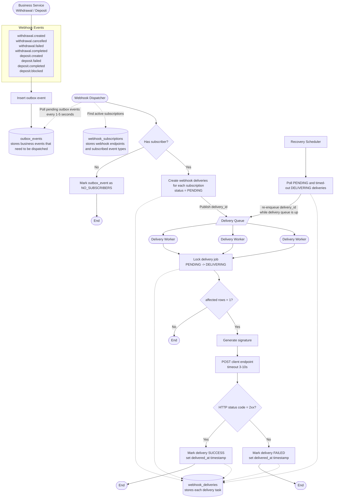

# Webhook Dispatch Flow Reference

This reference preserves an early Mermaid baseline for the webhook dispatcher, delivery worker, and recovery flow.

It is not the current source of truth for naming or schema details. Current decisions in [`../blueprint/blueprint.md`](../blueprint/blueprint.md), [`../design/design-persistence-model.md`](../design/design-persistence-model.md), and [`../design/design-queue-topology.md`](../design/design-queue-topology.md) override this reference.

Known differences from the current blueprint include:

- Table names here use plural or generic names such as `outbox_events`; current blueprint uses singular webhook-specific names such as `webhook_outbox_event`.
- Current blueprint also stores event type as a string in `event_type`; there is no `webhook_event_type` DB table.
- This reference uses `aggregate_type` / `aggregate_id`; current blueprint uses `resource_type` / `resource_identifier`.
- This reference uses `NO_SUBSCRIBERS` and `FAILED` as outbox statuses; current blueprint only keeps `PENDING` / `DISPATCHED` for outbox dispatcher state.
- This reference uses `secret` and `is_active`; current first-version data model does not include those fields.
- Current first-version event catalog includes `deposit.blocked`.

## Mermaid Flow



## Event Types

- `withdrawal.created`
- `withdrawal.cancelled`
- `withdrawal.failed`
- `withdrawal.completed`
- `deposit.created`
- `deposit.failed`
- `deposit.completed`

## Main Flow

1. A business service creates a withdrawal or deposit event.
2. The event is inserted into `outbox_events`.
3. The webhook dispatcher polls pending outbox events every 1-5 seconds.
4. The dispatcher finds active webhook subscriptions for the event type.
5. If there are no subscribers, the outbox event is marked `NO_SUBSCRIBERS`.
6. If subscribers exist, the dispatcher creates one `webhook_deliveries` row for each subscription.
7. Each delivery starts as `PENDING`, and its `delivery_id` is published to the delivery queue.
8. Delivery workers consume queue messages and attempt to lock the delivery job by moving it from `PENDING` to `DELIVERING`.
9. If the lock update affects one row, the worker generates a signature and posts to the client endpoint.
10. A `2xx` HTTP response marks the delivery `SUCCESS`.
11. A non-`2xx` response or delivery failure marks the delivery `FAILED`.
12. The recovery scheduler polls `PENDING` and timed-out `DELIVERING` deliveries and re-enqueues them while the delivery queue is available.

## Data Model Notes

### `outbox_events`

```ts
{
  id: string;
  event_id: string;
  event_type: string;
  aggregate_type: string;
  aggregate_id: string;
  merchant_id: string;
  payload: object;
  status: 'PENDING' | 'DISPATCHED' | 'FAILED' | 'NO_SUBSCRIBERS';
  created_at: Date;
  dispatched_at?: Date;
}
```

### `webhook_subscriptions`

```ts
{
  id: string;
  merchant_id: string;
  endpoint_url: string;
  secret: string;
  event_types: string[];
  is_active: boolean;
  created_at: Date;
  updated_at: Date;
}
```

### `webhook_deliveries`

```ts
{
  id: string;
  event_id: string;
  subscription_id: string;
  merchant_id: string;
  endpoint_url: string;
  payload: object;
  status: 'PENDING' | 'DELIVERING' | 'SUCCESS' | 'FAILED';
  created_at: Date;
  updated_at: Date;
  delivered_at?: Date;
}
```
